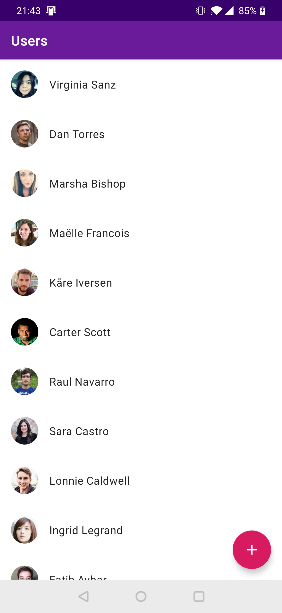
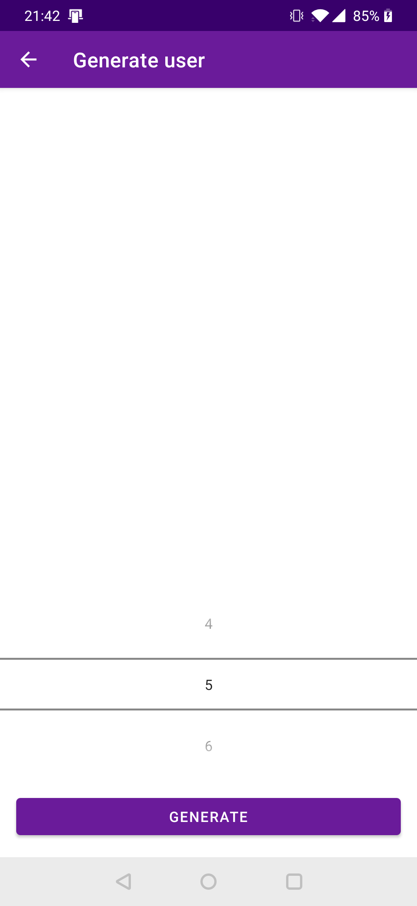

# Random User Android

Playground to check out trendy android stuff.

# Stack

- Multi-module
- Kotlin
- Dagger2
- kotlinx.coroutines
- Cicerone
- ktor
- kotlinx.serialization
- SQLDelight
- spek

# Screens

## User List

- Main app screen.
- List of users saved in local database.
- If list is empty there should be an empty message.

## Generate User

- Screen where user can generate random users via API.
- API users saved into local database
- User List should be refreshed

## About

- Libraries
- Links
- Version Information
